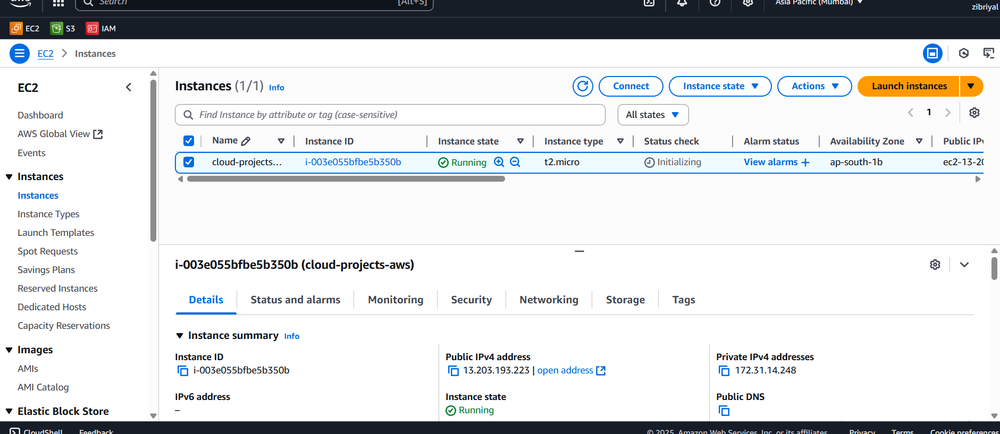
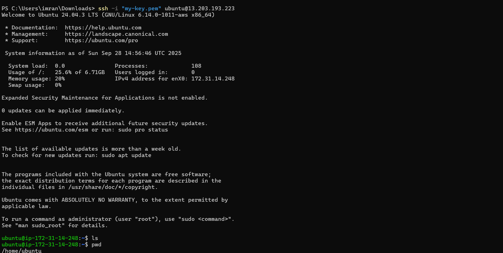
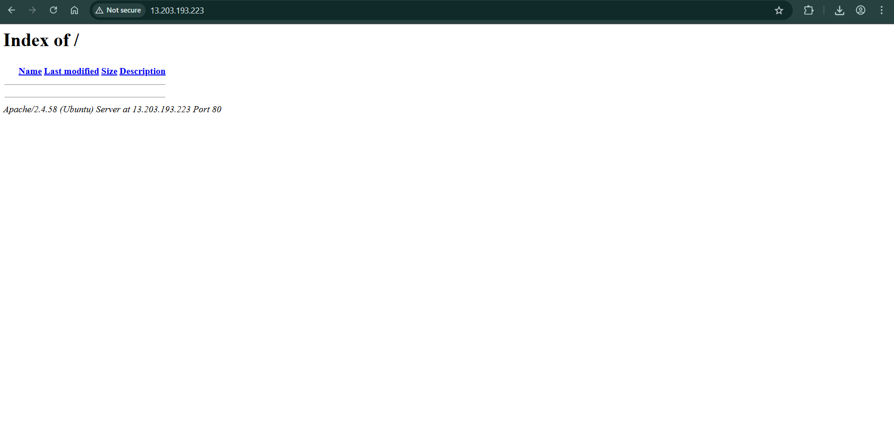
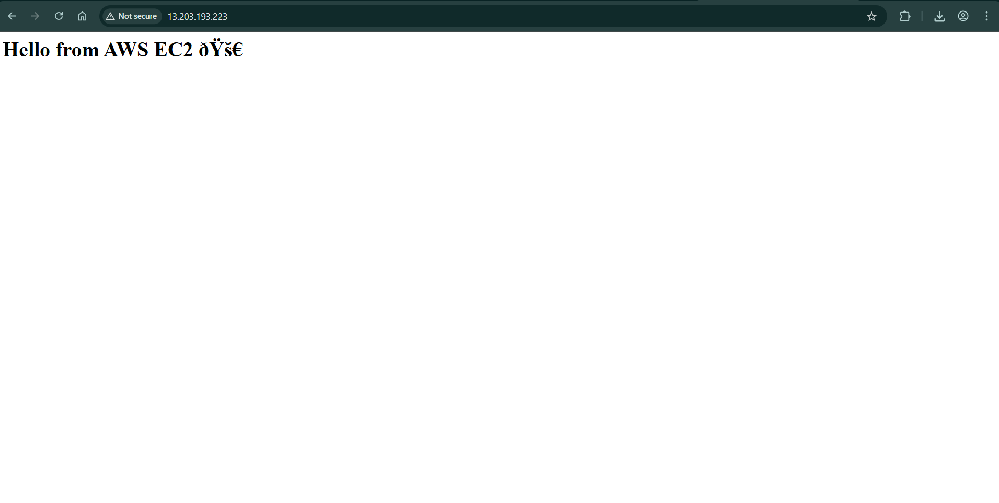

````markdown
# 🚀 AWS EC2 Hands-on Project

This project demonstrates how I learned and practiced **Amazon EC2** by launching a virtual server, configuring it, and hosting a simple website.  

---

## 📌 Project Overview
- Launch an **EC2 instance** (Ubuntu)
- Connect via **SSH**
- Install **Apache Web Server**
- Deploy a sample webpage
- (Optional) Attach and mount an **EBS Volume**

---

## 🛠️ Steps Performed

### 1. Launch EC2 Instance
- Open AWS Management Console → EC2
- Choose **Ubuntu 22.04 LTS**
- Instance type: **t2.micro** (Free tier eligible)
- Create new **key pair** → download `.pem` file
- Configure security group → allow **SSH (22)** and **HTTP (80)**
- Launch instance 🎉

📸 *Screenshot:*  
_()_


---

### 2. Connect to EC2
```bash
chmod 400 my-key.pem
ssh -i "my-key.pem" ubuntu@<EC2-Public-IP>
````

📸 *Screenshot:*
_()_

---

### 3. Install Apache Web Server

```bash
sudo apt update -y
sudo apt install apache2 -y
```

Check in browser:
`http://<EC2-Public-IP>`

📸 *Screenshot:*
_()_

---

### 4. Deploy a Sample Webpage

```bash
echo "<h1>Hello from AWS EC2 🚀</h1>" | sudo tee /var/www/html/index.html
```

Open in browser → you should see your custom page.

📸 *Screenshot:*
_()_

---


## 📂 Project Structure

```
ec2-setup/
│── Ec2.md   # Documentation (this file)
│── images/     # Screenshots
```

---

## 🔧 Tools & Services Used

* **AWS EC2** (Ubuntu 22.04 LTS)
* **Apache Web Server**
* **Linux CLI**
* **SSH**

---

## 🎯 Learning Outcome

* Understood EC2 basics: launch, connect, configure
* Learned how to set up a **web server on cloud**
* Gained hands-on cloud skills applicable to **real DevOps/Cloud projects**

---


